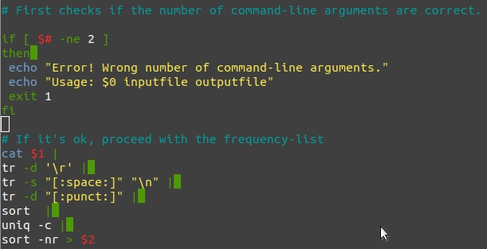

# Command-line course
## Introduction
The **Command-line Course** is a course focused on the command-line, which is a 
user interface navigated by textual commands, and how you can use it as a 
tool for linguistics.  

During the course we have been introduced to the command-line and its different 
commands and properties, for example regarding using and operating the Unix 
command-line, using the command-line for linguistics (regular expressions, corpora etc), 
running and installing programs and using Github. It's also important to 
be able to use google if (or when...) something goes wrong. 

Below is a short summary and reflections of the weekly contents and what I learned.  

In summary the weekly contents are:
1. Introduction to Command-Line Environments
2. Navigating a UNIX System 
3. Corpus Processing
4. Scripting and UNIX Configuration Files
5. Installing and Running Programs
6. Version Control
7. Final Assignment - Building a Webpage using Github

## Week 1: Introduction to Command-Line Environments  
The first week of the course contained an introduction to the command-line 
enviroments and its basics commands. The videos also contained some information 
about the different text editors and different file types like text files 
and binary files which can be used for different purposes.   

I have been using the command-line in some of my earlier courses in computer 
science, but I did still learn some new things even though I already knew the 
basic commands and was familiar to the environment. This week was still a good 
introduction to the course and the command-line.

###Example code from the week:

```
mkdir newDirectory
```
The *mkdir*-command makes a new directory called *newDirectory*.  

```
wget http://www.gutenberg.org/files/215/215-0.txt 
```
The *wget*-command downloads a file, in this case a textfile from the 
gutenberg.org-site. 


## Week 2: Navigating a UNIX System
During the second week we went through a lot about the UNIX System in general,
and the topics were about the filesystem, users and permissions, remote servers 
and processes. For example, the root account  has administrative rights 
and can for example add accounts, change passwords and install software.

I learned a lot during this week, since I haven't been familiar with the 
different users and permissions before. I also think its good to know the 
underlying functions of the different processes and how they work. 
Unfortunately I could not try out all the different commands (like *sudo*) 
since I had to work on my University-account via the VMware Horizon Client.

### Example code:

```
ln -s textfile.txt symbolic_link
```
This command creates a symbolic link that points to the source file.

```
sudo su
```
This will gain root, but the user or the user environment won't 
change. 


## Week 3: Corpus Processing
This week's topics showed how you can use the command-line for linguistic 
purpose like corpus processing. We got introduced to formatted text files, 
standard streams, text processing commands and task, regular expressions, grep, 
and sed.

In the Introduction to Language Technology I got familiar with regular 
expressions, but I still got a better and larger picture of how you can use 
them. 

### Example code:        

```
cat life_of_bee.sent | grep -E "\bhoney\b"  | wc -l
```
This snippet of code will show the word-count (*wc -l*) from the file 
(*life_of_bee.sent*) that contains the word form *honey*, with the help of grep.


## Week 4: Scripting and UNIX Configuration Files
During this week we worked a lot with variables, the .bashrc file and also 
started looking at scripts and how these can be used. A .bashrc-file is 
a file that contains commands that the shell will read and execute, 
whereas scripts can for example contain command pipelines that execute 
different tasks.

I learned a lot during this week since I hadn't been using scripts earlier. 
I also think this week contained a lot of interesting and necessary things that 
will be useful in the future. I also got more familiar with the .bashrc-file 
and how useful it can be.

### Example code:

```
diff --brief $FILE1 $FILE2 >/dev/null
comp_value=$?
```
This is a part of a script, and it compares the diff-output (*diff --brief* 
produces output when the files differ) from two files.

Here is also a picture of a larger script that was made for one of the quizzes:




## Week 5: Installing and Running Programs
The fifth week was about installing and running different software like Python, 
C and C++. We also got introduced to *make* and the *makefile*, which can be 
used for building projects.  

I think that this week was very interested, and I learned a lot of new things. 
I really liked the idea of make and I think that the makefile is a very good 
thing to know and be able to use.

### Example code:        

```
%.no_md.txt: %.txt
        python3 src/remove_gutenberg_metadata.py $< $@
```
This is part of the code in a Makefile, *%.no_md.txt* is the file that is 
created. For every .txt-file the python-script is runned, and the results 
are then saved to the new file.

## Week 6: Version Control
This week continued with the installing and running software-theme with Java, 
and the rest of the week was about version control using Git and Github. Git 
is a version control system, whereas github is a software development platform.

Even though I have been using Github for a project before, I learned new things 
during the week. I have earlier just been using the master-branch, but I now 
understand why it's suitable to create new branches for different parts of a 
project etc. 

### Example code - useful git-commands:

*Command*               | *Description*
------------------------| -------------
git add file            | Adds the file 
git add -A              | Adds all the files that are untracked or new
git commit -m "Comment" | Commits the changes to git with a message
git push                | Pushes the changes to the remote repository
git branch              | Shows which branch you are working on
git branch new_branch   | Creates a new branch

## Week 7: Final Assignment - Building a Webpage using Github
The Final Assignment of this course was to create and build an  own website  with
different contents. A big part of the assignment was about Jekyll and Github Pages.  

I have been using Github before, but Jekyll was a new experience for me. I also 
really liked the idea that you can use a specific layout that you could also 
edit. Overall I liked the final assigment and think it is very useful to know 
these kinds of things :)

### Example code:        

```
git clone https://github.com/elgecaro/elgecaro.github.io.git
```
This command clones my github repository, and it will then work as a local 
repository.
