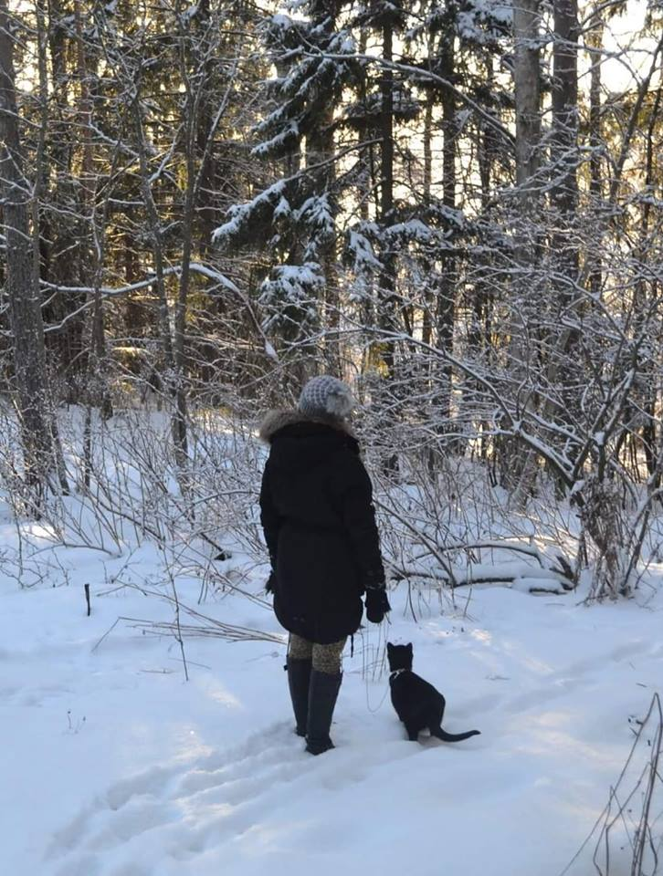

## Introduction

 
My name is Caroline and this is my fourth year studying the Nordic Languages at Helsinki University. (under construction)

## Find me on

[GitHub](https://github.com/elgecaro)

## Contact

My email address is of the form first_name.last_name@helsinki.fi. 

## Courses I've Taken

**Language technology:**  
[KIK-405: Introduction to language-technology](https://courses.helsinki.fi/en/kik-405), fall 2018  

**Computer Science:**  
[Methods for Software Engineering](), spring 2018    
[Computer Organization 1](), fall 2017  
[Introduction to Databases](), spring 2017  
[Advanced Course in Programming](), fall 2016  
[Introduction to Programming](), fall 2016  

**Nordic Languages:**    
(under construction)

## Projects
[cmdline-course](https://github.com/elgecaro/cmdline-course): A repository for the cmdline-course. 2018  
[otm-harjoitustyö](https://github.com/elgecaro/otm-harjoitustyo): A project regarding a exercise-program that I made for the course *Methods for Software Engineering*. 2018

## Misc. 

